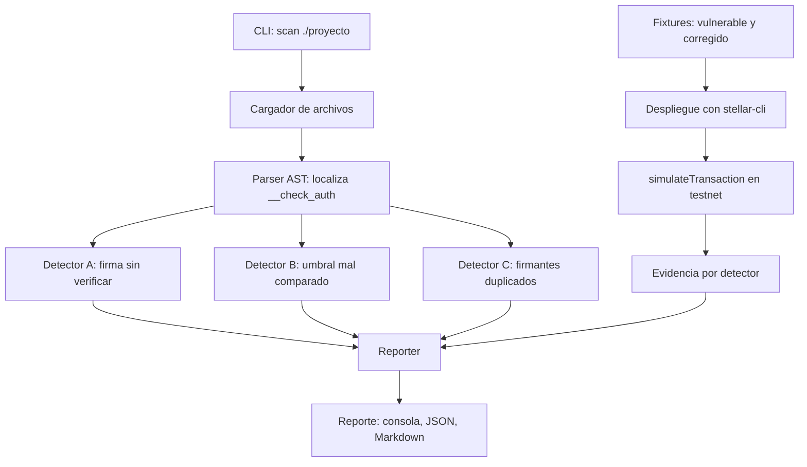

# Analizador multisig para Soroban

Herramienta de línea de comandos que inspecciona la implementación de `__check_auth` en cuentas personalizadas de Soroban y detecta fallas de autorización: firmas sin verificar, firmantes duplicados y umbrales mal comparados. Cada hallazgo se puede reproducir en Stellar Testnet, donde el contrato vulnerable acepta la llamada y el corregido la rechaza.

Proyecto para el track Research & Crypto (seguridad: cuentas multisig y detección temprana de fallas).

## Flujo



- **Análisis local (sin red):** CLI, cargador, parser, detectores y reporter.
- **Evidencia en testnet (con red):** fixtures, despliegue, simulación y log. Se adjunta al reporte final.

## Detectores

| Id | Qué detecta | Estado |
|----|-------------|--------|
| A | Firma recibida sin verificación criptográfica | Pendiente |
| B | Umbral mal comparado (`>` en lugar de `>=`, o al revés) | Pendiente |
| C | Firmantes duplicados que cuentan doble | Pendiente |

## Estructura del repositorio

```
soroban-multisig-analyzer/
├── README.md
├── pyproject.toml
├── src/analyzer/
│   ├── cli.py              # comando scan
│   ├── loader.py           # lee los .rs del proyecto
│   ├── parser.py           # AST con tree-sitter, localiza __check_auth
│   ├── finding.py          # modelo de hallazgo
│   ├── reporter.py         # consola, JSON, Markdown
│   └── detectors/
│       ├── missing_signature.py
│       ├── threshold.py
│       └── duplicate_signers.py
├── fixtures/
│   ├── missing_signature/{vulnerable,fixed}/
│   ├── threshold/{vulnerable,fixed}/
│   └── duplicate_signers/{vulnerable,fixed}/
├── tests/
├── scripts/
│   └── testnet_evidence.sh # Friendbot, despliegue y simulación
└── docs/
    └── evidence/           # logs de testnet por detector
```

## Uso

```bash
pip install -e .
analyzer scan ./fixtures/missing_signature/vulnerable
```

## Estado

- [ ] Fixtures del detector A
- [ ] Cargador y parser
- [ ] Detector A
- [ ] CLI con salida en consola
- [ ] Detectores B y C
- [ ] Evidencia en testnet
- [ ] Reportes JSON y Markdown

## Limitaciones

- El análisis es sintáctico (tree-sitter), no semántico, así que puede haber falsos positivos. Se documentarán en `docs/`.
- Un contrato ya desplegado solo expone WASM, no fuente, por lo que los detectores sobre código no corren sobre él.

## Trabajo futuro

- Detectores para verificadores ZK (nullifiers sin chequear, public inputs no ligados al destinatario, raíces de Merkle sin validar).
- Detector de replay (nonce o expiración) en `__check_auth`.